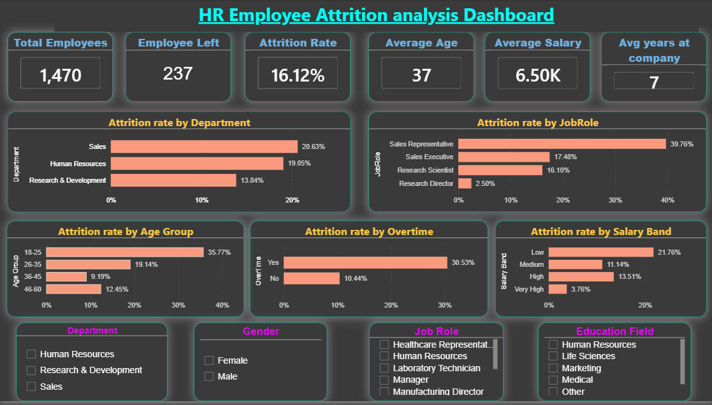
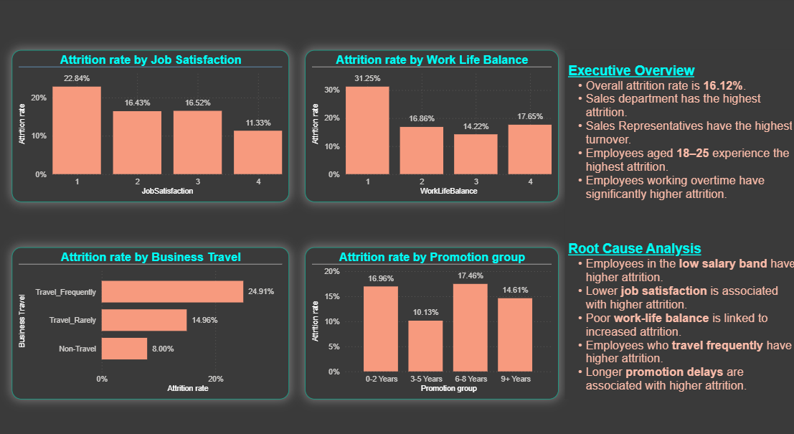

## &#x20;                    ***HR Employee Attrition Analysis Dashboard***

##### \## 📌 Project Overview

Employee attrition is one of the biggest challenges faced by organizations. High employee turnover increases hiring costs, affects productivity, and reduces overall business performance.

This Power BI dashboard analyzes HR employee data to identify:

\- Overall attrition rate

\- Departments with high attrition

\- Job roles with maximum employee turnover

\- Age groups most affected

\- Impact of overtime

\- Salary band analysis

\- Root causes of employee attrition

\---

##### 

##### \## 🎯 Business Problem

The HR department wants to understand why employees are leaving the company and identify the major factors contributing to employee attrition.

The goal is to help management make data-driven decisions to improve employee retention.

\---

##### \## 📊 Dashboard Pages

###### \### Page 1 – Executive Overview

Provides a high-level summary of employee attrition using KPIs and interactive visuals.

Key KPIs:

\- Total Employees

\- Employees Left

\- Attrition Rate

\- Average Age

\- Average Salary

\- Average Years at Company

Visualizations:

\- Attrition Rate by Department

\- Attrition Rate by Job Role

\- Attrition Rate by Age Group

\- Attrition Rate by Overtime

\- Attrition Rate by Salary Band

Interactive Filters:

\- Department

\- Gender

\- Job Role

\- Education Field

\---

###### \### Page 2 – Root Cause Analysis

Focuses on identifying the possible reasons behind employee attrition.

Visualizations:

\- Attrition Rate by Job Satisfaction

\- Attrition Rate by Work-Life Balance

\- Attrition Rate by Business Travel

\- Attrition Rate by Years Since Last Promotion

\---

###### \## 📈 Key Insights

\### Executive Overview

\- Overall employee attrition rate is \*\*16.12%\*\*

\- Sales department has the highest attrition.

\- Sales Representatives experience the highest employee turnover.

\- Employees aged \*\*18–25\*\* show the highest attrition.

\- Employees working overtime are significantly more likely to leave.

\### Root Cause Analysis

\- Employees in the \*\*Low Salary Band\*\* have the highest attrition.

\- Lower Job Satisfaction is associated with higher attrition.

\- Poor Work-Life Balance contributes to increased attrition.

\- Employees who travel frequently have higher attrition.

\- Employees with \*\*6–8 years since their last promotion\*\* show the highest attrition.

\---

###### \## 🛠 Tools Used

\- Power BI Desktop

\- Power Query

\- DAX

\- Data Modeling

\---

###### 

###### \## 📁 Files Included

\- HR Employee Attrition Dashboard.pbix

\- Dashboard Screenshots

\- README.md

\---

###### \## 🚀 Skills Demonstrated

\- Data Cleaning

\- Data Modeling

\- DAX Measures

\- Interactive Dashboard Design

\- Business Analysis

\- KPI Development

\- Root Cause Analysis

\- Data Visualization

\---

###### \## 📷 Dashboard Preview

\### Executive Overview

\### Root Cause Analysis

\---

###### \## 📌 Conclusion

The dashboard highlights that employee attrition is primarily concentrated among young employees, sales representatives, overtime workers, and employees in lower salary bands. These insights can help HR teams develop targeted strategies to improve employee retention.

\---

###### \## 👤 About the Author

This project was designed and developed by \*\*Varshitha Rachapudi\*\* as part of my Power BI portfolio.

I am passionate about Data Analytics, Business Intelligence, and creating interactive dashboards that help organizations make data-driven decisions.

\### Connect with me

\- GitHub: https://github.com/varshitha12-ux

\- LinkedIn: https://www.linkedin.com/in/varshitha-rachapudi-a5156a348?utm\_source=share\_via\&utm\_content=profile\&utm\_medium=member\_android

